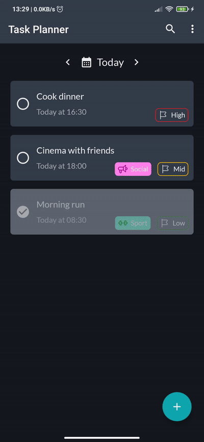

# TaskPlanner
This is an android application for monitoring your tasks and plans

## Features
* Shows your tasks separately for each day
* Navigate through days by arrows or choose date from calendar
* Easily create, modify and delete tasks
* Mark task as completed
* Choose date, time, category and priority of task
* Search through all your tasks by title or category
* Choose convenient for you task sorting (by time or priority)

## Implementation
This app is designed as MVVM architecture pattern

### Model
  * __Room__ - to save tasks in database
  * __Kotlin flows__ - to manage queries to database
### ViewModel
  * __LiveData__ - to implement observable pattern
### View
  * __Navigation component__ - to navigate between fragments
  * __Data binding__ - UI interaction

## Demo

